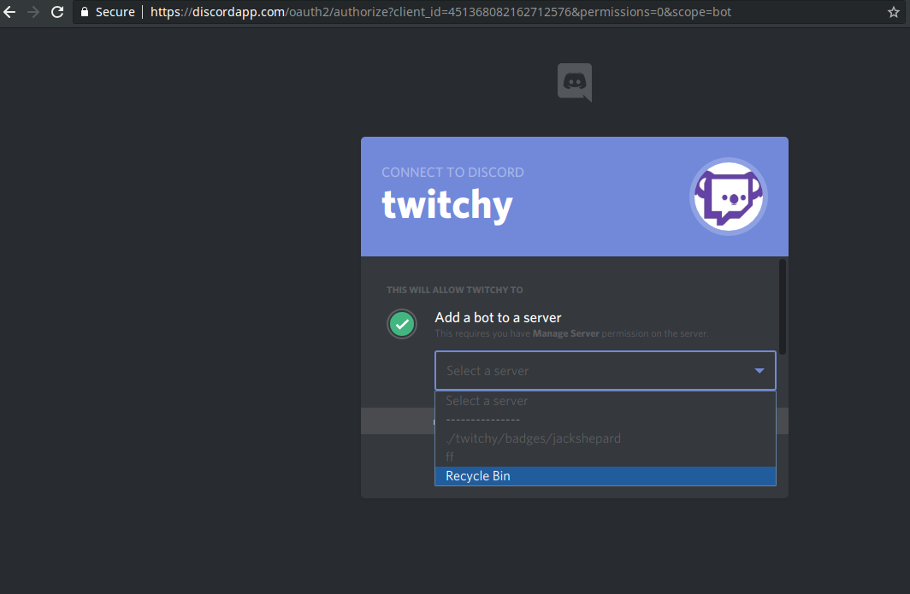

# как добавить бота в гильдию;

## [перейти по ссылке-приглашению бота;](https://discordapp.com/api/oauth2/authorize?client_id=451368082162712576&permissions=0&scope=bot)

### приглашение бота осуществляется через браузер, поэтому возможно придется войти в свою учетную запись сначала;

## в выпадающем списке выберите гильдию в которую желаете пригласить;

### если по какой-то причине вы не можете пригласить бота - свяжитесь с его владельцем `allan_walpy#3408` или `walpy#7700` - возможно он отключил свободное присоединение бота по каким-либо причинам;

### на этом уже можно начинать работать с ботом;

#### [начать записывать логи в дискорд;](./discord_channel.md)

#### [добавить боту смайлесы;](./emojie_managment.md)