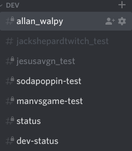
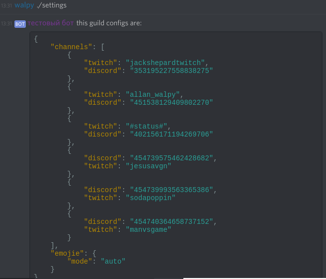

# как начать логи твич канала в свою конфу;

## 1 способ;

### перейти в канал в который вы хотите бот записывал логи;

### написать и отправить в канал комманду `./add/имя_канала_твича`

## 2 способ;

### перейти в любой канал вашей конфы;

### написать и отправить в канал комманду `./add/имя_канала_твича/id_дискорд_канала`

#### [как узнать id дискорд канала](./discord_channel_id.md)

## проверить что канал добавлен;

