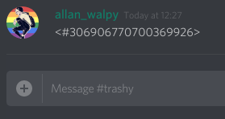
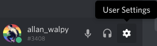
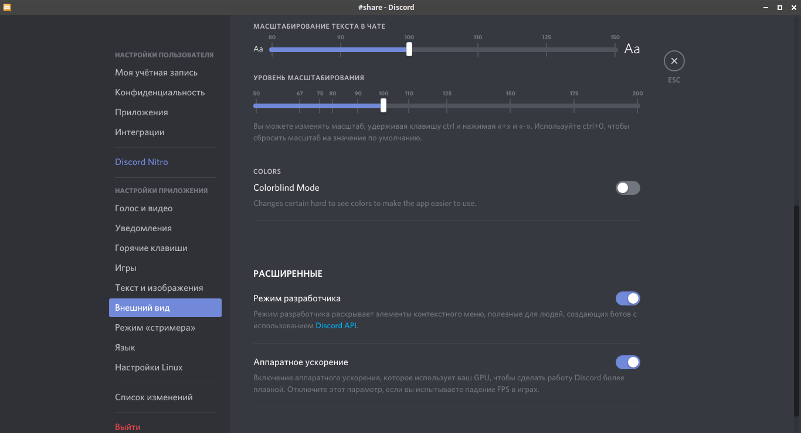
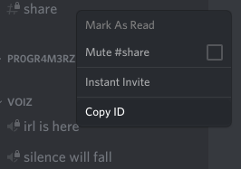
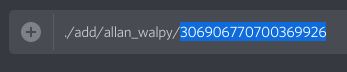

# как найти id канала дискорд

## 1 способ

### написать в своей конфе любом канале в поле ввода `#имяКанала`;

### поставить `\` перед `#`;

### отправить;

### скопировать циферки - они и есть искомый id;

## 2 способ

### открыть настройки клиента дискорд;

### перейди в Appearence/Внешний вид -> Advanced/Расширенные и включить Developer Mod/Режим разработчика;

### щелкнуть правой кнопкой мыши по желемому каналу и выбрать Copy Id/Копировать Id;

### вставить id из буфера обмена;

