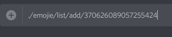
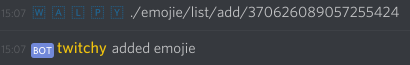
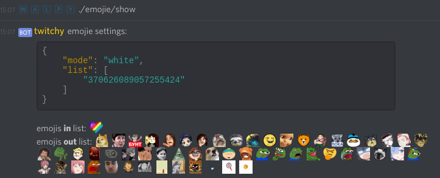
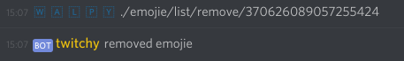
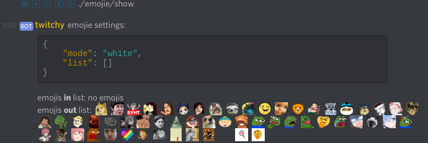
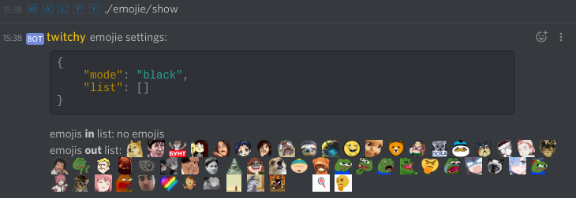

# как добавлять в бота смайлесы;

## info;

### для того чтобы добавить смайлес в бота - нужно чтобы его имя в дискорде (с учетом регистра) было такое же как на твиче;

### смайлесы добавляются глобально - он будет их использовать во всех остальных конфах, что находится;

#### ввиду пункта выше - списки добавленных смайлесов будут доступны владельцу бота и могут быть изменены (если в них добавляются не существующие ни в твиче ни в better.tv смайлесы, ломающие простые сообщения пользователей);

### при добавлении смайлесов необходим перезапуск бота, осуществляемый владельцем бота;

есть список, в него можно добавлять и удалять смайлесы;

есть emojie/mod имеющий следующие значения:

- **auto;** добавляет все смилесы из вашей конфы, игнорируя список;

- **white;** добавляет все смайлесы из вашей конфы, **указанные** в списке (whitelist);

- **black;** добавляет все смайлесы из вашей конфы, **не указанные** в списке (blacklist);

## добавление;

- [узнать id смилеса;](./docs/emojie_managment_id.md)

- ввести в любой канала конфы, где есть бот `./emojie/list/add/IdСмайлеса`;

- отправить;

- проверить что смайл добавился в список с помощью команды `./emojie/show`;

## удаление;

- [узнать id смилеса;](./docs/emojie_managment_id.md)

- ввести в любой канала конфы, где есть бот `./emojie/list/remove/IdСмайлеса`;

- отправить;

- проверить что смайл удалился из списка с помощью команды `./emojie/show`;

## изменить emojie mod;

- ввести в любой канала конфы, где есть бот `./emojie/set/mode`, где `mode`:
  - `auto` - добавить все смайлы;
  - `black` - добавить все смайлы, кроме указанных в списке;
  - `white` - добавить все смайлы, указанные в списке;

- отправить;

- проверить что mode изменился с помощью команды `./emojie/show`;

